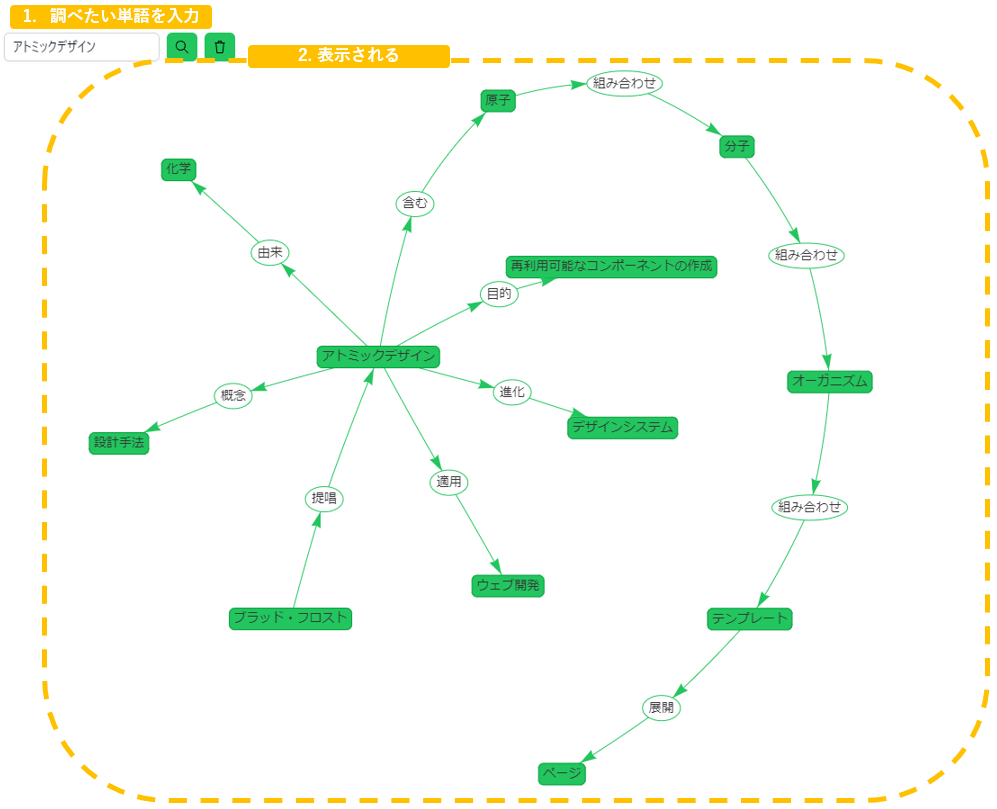
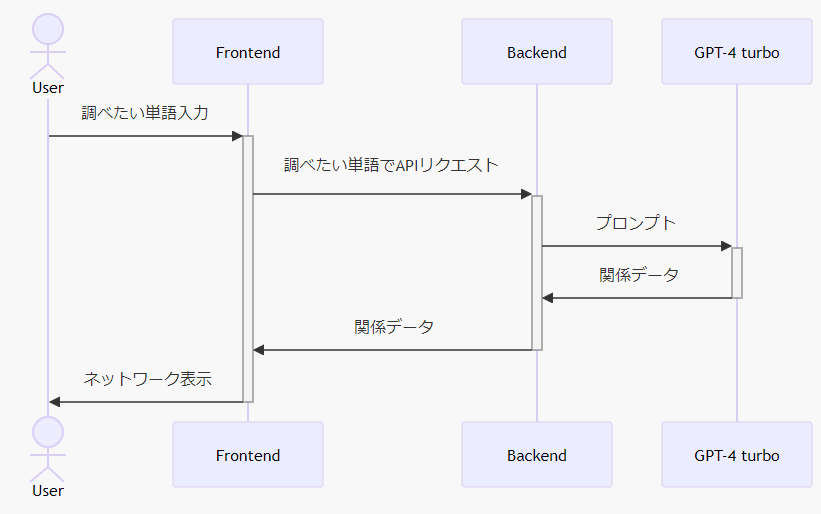

## 作ったもの



## 構成技術

### Frontend

- [Nuxt.js](https://nuxt.com/)
- [vis.js](https://visjs.org/)

### Backend

- [Express.js](https://expressjs.com/ja/)
- [LangChain](https://www.langchain.com/)

### LLM

- [GPT-4 Turbo](https://platform.openai.com/docs/models/gpt-4-and-gpt-4-turbo)

## 仕組み

### シーケンス



### プロンプト

```
  const systemPrompt =
    "あなたは与えられた単語と他の単語の関係を説明するシステムです\n" +
    "フォーマット:\n" +
    "主語,関係,目的語\n" +
    "\n" +
    "ルール:\n" +
    "主語:単語または、与えられた単語 説明文における主語\n" +
    "目的語:単語、与えられた単語 説明文における目的語\n" +
    "関係:動詞または、主語の被修飾名詞または、目的語にかかる形容詞または、目的語の修飾名詞\n" +
    "\n" +
    "「リンゴ」が与えられた単語の時の例:\n" +
    "リンゴ,一部,果物\n" +
    "人間,食べる,リンゴ\n" +
    "ジョナゴールド,品種,リンゴ\n" +
    "リンゴ,色,赤\n" +
    "ニュートン,見る,リンゴ\n" +
    "ニュートン,発見する,万有引力\n" +
    "りんご,重さ,35~1000グラム\n" +
    "りんご,浮く,水\n" +
    ""

  const prompt = ChatPromptTemplate.fromMessages([
    ["system", systemPrompt],
    ["human", topic],
  ]);
```

### 関係データ

「サンマ」を検索した際の例

```
サンマ,食べる,魚
カレイ,同じくらいの大きさ,サンマ
サンマ,美味しい,焼き魚
サンマ,季節,秋
サンマ,主役,料理"
```

## 課題と改善点

### 前回の検索結果を元にした検索

現状は、APIリクエストごとに会話が作り直されるので、突拍子もない検索結果が返却されることがある。
セッションを作りそこにメモリを紐づけて不揮発で保持していくようにする。

LangChainにはこれらをいい感じに実装する[Chat Message History](https://python.langchain.com/docs/modules/memory/chat_messages/)というチャット履歴を管理する機能がある。
これのDynamoDBの操作に対応した[モジュール](https://python.langchain.com/docs/integrations/memory/aws_dynamodb#dynamodbchatmessagehistory)が提供されているのでこれらを使ってサクッと対応しちゃいたい。
これを行うと、プロンプトの上限問題も発生するが、GPT-4 Turbo 前提でコンテキストウィンドウは余裕あるので、ある程度は無視しててもよさそう。

### 文章->ネットワークのルールが曖昧

矢印の指す意図が、文法におけるどの役割を指すのかが明確になっていない。
一例として、「果物 -> 赤い -> リンゴ」「リンゴ -> 赤い -> 果物」もそれぞれの意味を知っていれば理解可能だが
単語に関する知識がないと、「赤いリンゴは果物」なのか「赤い果物はリンゴ」なのか、判断がつかない。

また、「リンゴ -> は -> 赤い」のように、関係が「は」のみの時の表現方法 等

ある程度までなら、プロンプトを調整することで対応できそうだが、全ての文法に対応することは難しく、
そこに関してはあいまいさを残す方が、本ツールでやりたいことに十分なので、自身が満足するまではプロンプト調整していく。
また、CoTやSelf-Consistency等のプロンプトエンジニアリングでよく用いられる手法はいくつか検証して比較する。

### 同義語をまとめる

現状、単語の文字列が識別子のため同義語が別の単語としてネットワークに描画される。
例：埼玉 と 埼玉県　等
これらを同じエンティティとしてまとめてネットワーク表示する必要がある。

これは、LLMの埋め込みモデルを利用して解決する。
各単語を埋め込みモデルを用いて数値ベクトル化し、コサイン類似度等のベクトルの類似度を算出して、
一定の閾値を上回ったときに同義語として扱う。

### 単語・関係の正規化

同義語の件と課題は似ている。
同じ言葉でも、表記ゆれによって異なる単語として描画される。

これは一般的には形態素解析を用いて解決することが多い。
実用的なライブラリは探せばありそうなので、その辺を試しながら考えたい。（あまり仕組みを理解できていないので）

## 今後

### RAG対応

LLM単体の知識だけでなく、外部の知識を活用する。

### 既存文章のネットワーク化

特に、論文や書籍、RFCなどを要約・可視化することで新たな価値が得られないか模索したい。

## 総括・感想

予想より簡単に作れましたが、まだまだ作りこみが甘いです。
モデルを GPT3.5 turbo から　GPT-4 turboに切り替えることでだいぶ改善しましたが、課題はまだまだ残っています。
今後も勉強ついでに機能を追加・改善していくつもりです。(今のところは)
作りながら、生かせそうな分野を探してそこで活用していければと思います。

LLMのシステムへの適用として、DBやキューと同じように、ビジネスロジックモジュールみたいなものが追加されたと思うと、設計しやすいのかなと思いました。

ここはこうしたほうがいいんじゃないか とか こんな使い方したらおもしろそう 等あればコメントいただけると幸いです。
